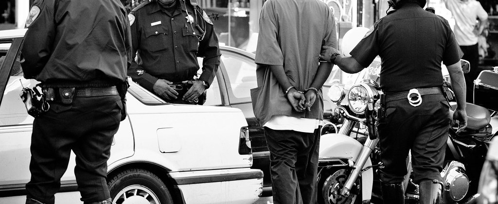
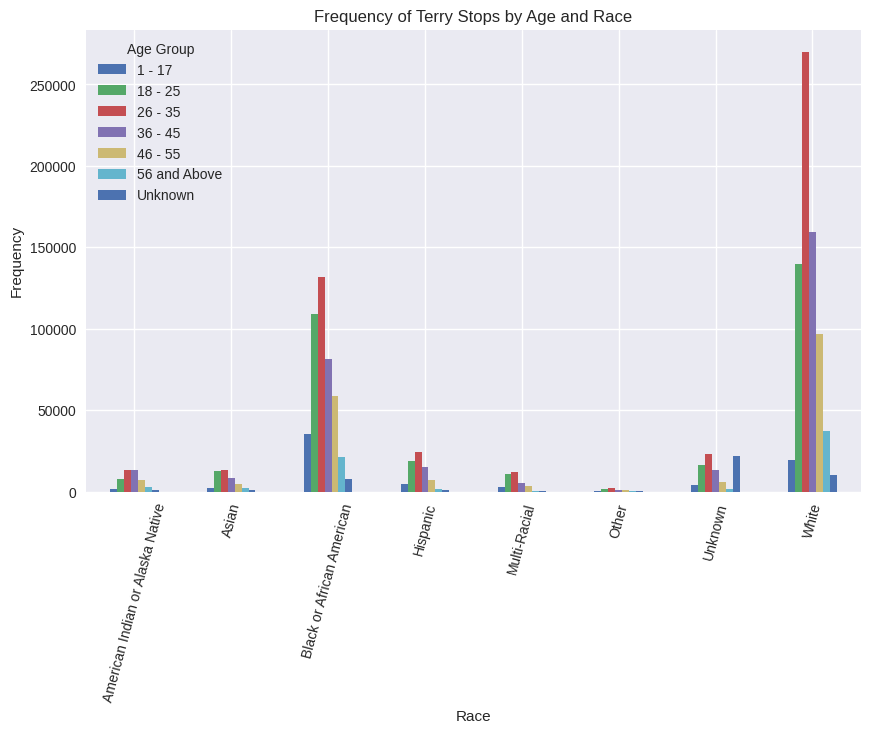
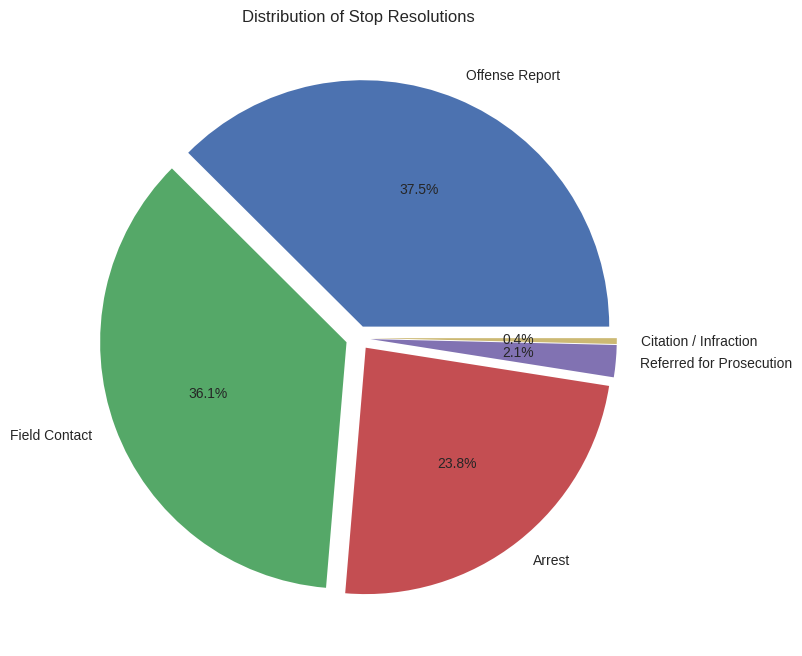
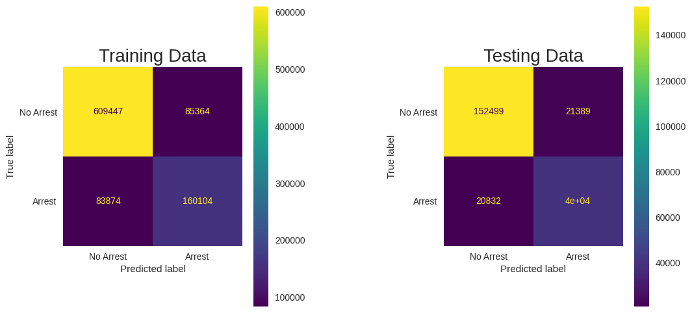
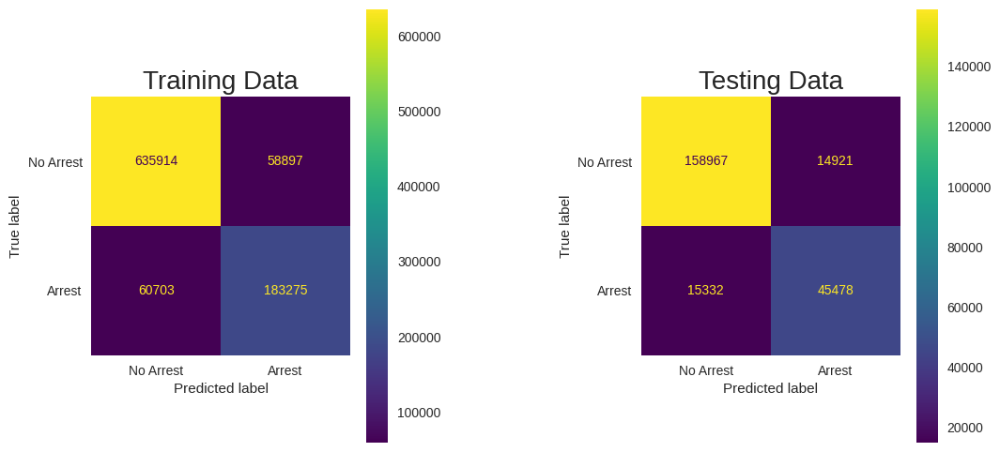
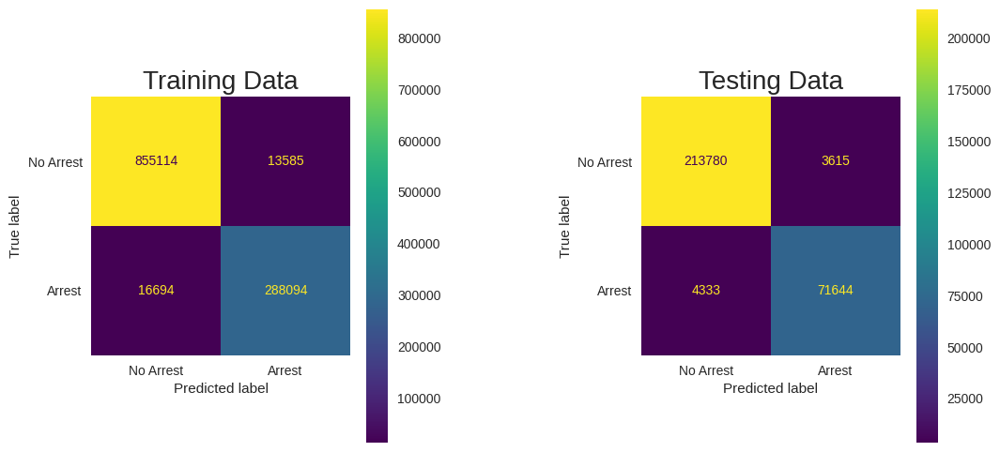
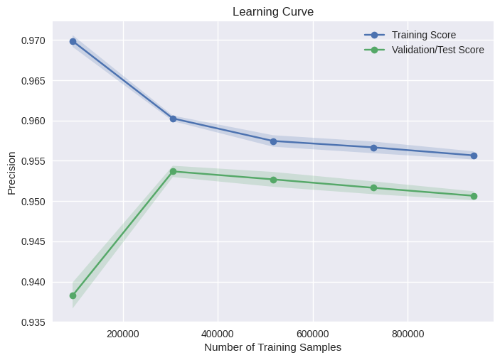

# TERRY STOPS

**Author**: [Robert Mbau](https://github.com/robertmbau)

 

## Overview

In Terry v. Ohio, a landmark Supreme Court case in 1967-8, the court found that a police officer was not in violation of the "unreasonable search and seizure" clause of the Fourth Amendment, even though he stopped and frisked a couple of suspects only because their behavior was suspicious. Thus was born the notion of "reasonable suspicion", according to which an agent of the police may e.g. temporarily detain a person, even in the absence of clearer evidence that would be required for full-blown arrests etc. Terry Stops are stops made of suspicious drivers.

## Problem Statement

This project aims to build a model that can accurately predict the result of a Terry Stop i.e Arrest or No Arrest.
By applying the features from the dataset, this model will learn patterns and relationships that will help to differentiate those two outcomes.

## Data

The updated Terry dataset is available on the [Seattle Goverment Website](https://data.seattle.gov/Public-Safety/Terry-Stops/28ny-9ts8) website.
The dataset contains various attributes related to the stops, including demographic information, stop location, stop reasoning, and outcomes.
his data represents records of police reported stops under Terry v. Ohio, 392 U.S. 1 (1968). Each row represents a unique stop.

- Each record contains perceived demographics of the subject, as reported by the officer making the stop and officer demographics as reported to the Seattle Police Department, for employment purposes.

- Data used in this project can be found in the folder `data` under the name `Terry_Stops.7z`. Extract it in the folder.

### Modeling Process
In the cleaning phase, missing values were dropped as the dataset was big enough for such a radical move. Placeholders were treated in ways that retained a lot of the data and kept the integrity. 

Once cleaning was done, some EDA was done on some columns to view distributions in the data as can be seen below:



After that Feature Engineering was done to transform the data into meaningful features that could be used in the models. The data was split twice using train test. The reason for splitting twice was for the final model to be evaluated on unseen data.

Several models were created after this. Their results can be seen below:

#### Logistic Regression

The model had a precision score of 0.65 on the test data. The other metrics were also poor.

#### Decision Tree

This model was among the best performing with a precision score of 0.95 0n the test data. The other metrics also supported this model although precision was the chosen metric.

#### Random Forest

It produced similar results to the decision tree model with a precision score of 0.95. It however needed a lot of computational power and runtime.

#### XGBoost

The model had better metrics than the Logistic Regression but they could not satisfy the threshold.

#### Final Model
The final model was the Decion Tree. It was validated using unseen data from the train test splits and it performed well. It had a precision score of 0.95 on the validation data. 





The learning curve showed that more data does not necessarily translate to higher metrics.

## Evaluation
The final model was able to predict with a high accuracy. The model's metrics were high across the board although Precision score was the metric being considered. That combined with the results from the confusion matrix showed that the model was able to generalize to unseen data as it had a high precion score on that too.

## Conclusion

* Engineering of new target and features and remodelling.
* Assess how grouping features affects the models.
* Attempt training without grouping the features(Will require high processing power or a very small sample of the data)
* Use multiclass prediction for the target. Example: There are multiple types of resolutions are possible instead of grouping to Arrest or No Arrest.

## Disclaimer
The models provided are intended for learning purposes only. It is important to note that the predictions made by the models may incoporate human bias thus should not be used for any other purposes apart from learning or for critical projects. 
The performance and accuracy of the models might be influenced by various factors such as grouping of features and their selection.

## For More Information

See the full analysis in the [Jupyter Notebook](./terry_stops.ipynb) or review this [presentation](./presentation.pdf).

## Repository Structure

```

├── data
├── images
├── imports
├── notebook.pdf
├── presentation.pdf
├── README.md
└── terry_stops.ipynb
```